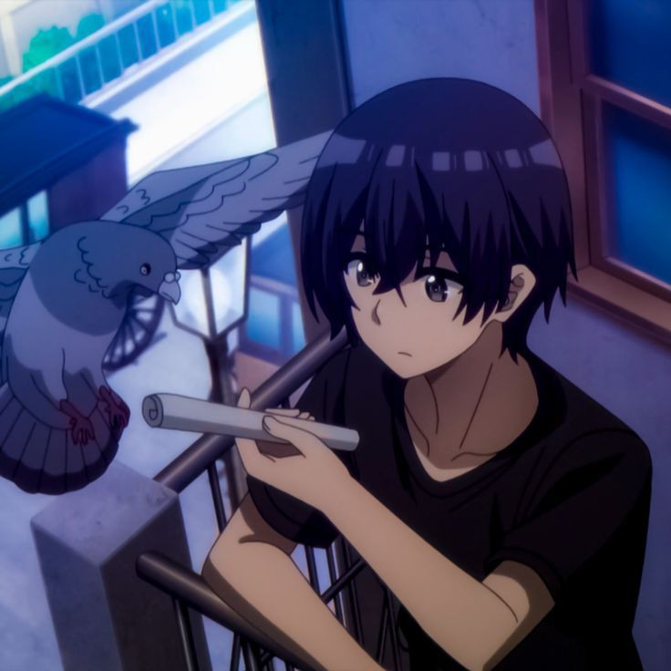

<h1 align="center">
    

    
    </h1>
  

<h3 align="right">🍺🥂🍸 𝓐 𝓹𝓪𝓼𝓼𝓲𝓸𝓷𝓪𝓽𝓮 𝓼𝓸𝓯𝓽𝔀𝓪𝓻𝓮 𝓭𝓮𝓿𝓮𝓵𝓸𝓹𝓮𝓻 𝓯𝓻𝓸𝓶 𝓔𝓪𝓻𝓽𝓱 🍻🍷🍹</h3>

 

<dl>
    <dt align="left"><strong>firstName:<strong/></dt>
        <dd align="left"><em>Cₕᵣᵢₛₜᵢₐₙ</em></dd>
          <dt align="left"><strong>LastName:<strong/></dt>
        <dd align="left"><em>ʲ.ᴺⁱᵐᵇᵘᵉⁿ</em></dd>
         <dt align="left"><strong>Loves:<strong/></dt>
              <dd align="left"><em>ᶜᵒᵈⁱⁿᵍ👨‍💻</em></dd>
        
</dl>

  <h1 align="center" color="gold">𝓡𝓮𝓪𝓬𝓱 𝓶𝓮 𝓪𝓽<h1/>

 
  
  
  <a href="https://chrisjoy-github-io.vercel.app/" target="_blank">
      <!-- sqlite, safari, google-chrome are other good icon options -->
  </a>

 

 
<h2 align="center">⚒️ 𝓛𝓪𝓷𝓰𝓾𝓪𝓰𝓮𝓼-𝓕𝓻𝓪𝓶𝓮𝔀𝓸𝓻𝓴𝓼-𝓣𝓸𝓸𝓵𝓼-𝓲-𝓾𝓼𝓮 ⚒️</h2>
 

    
    

 

  <h2>🐍 𝓜𝔂 𝓒𝓸𝓷𝓽𝓻𝓲𝓫𝓾𝓽𝓲𝓸𝓷𝓼 🐍</h2>
   
  
  
     

<h2 align="center">⚡ 𝕾𝖙𝖆𝖙𝖘 ✍⚡</h2>
 
 
 <picture>
  <source
    srcset="https://github-readme-stats.vercel.app/api?username=ChristianNimb&show_icons=true"
    media="(prefers-color-scheme: light), (prefers-color-scheme: no-preference)"
  /> 
  
</picture>
    

  

 

 
